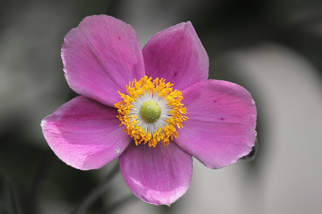

# タイトルがここに入ります

日時：2017年9月27日 14時〜  
場所：◯◯◯◯

<!--
https://github.com/yamap55/SlideWithGitHubPages
-->

---

## はじめに

* 配布物の確認
* 「寒い」「暑い」は遠慮なくおっしゃってください。エアコン調整します
* トイレの場所は、◯◯◯◯◯◯◯◯◯
* 写真を数枚撮りブログ掲載する可能性があります。困る方はおっしゃってください
* スライドの写真を取るのはOK(Noフラッシュで)。内容のネット公開はご遠慮ください
* このスライドはネットで[公開](https://takunagai.github.io/SlideWithGitHubPages/index.html?slide=slide_01/index.md)します(一部非公開になる可能性あり)  

---

## 自己紹介

- 名前：永井 拓也 (ながい たくや)
- 出身地：兵庫県川西市
- 経歴：
- 仕事の内容：
- 趣味：
- 

---

## アイスブレイク

1. 自己紹介
2. 用紙に自分が言われたら嬉しいことを３つ書く(2分間)

脳が活性化

---

## 本日のおしながき

<section data-background="https://takunagai.github.io/SlideWithGitHubPages/slide_01/img/img1.jpg">

1. □□□□□□□□□
2. ◯◯◯◯

</section>

---

## フラグメントのテスト

<section>
	<p class="fragment grow">grow</p>
	<p class="fragment shrink">shrink</p>
	<p class="fragment fade-out">fade-out</p>
	<p class="fragment fade-up">fade-up (also down, left and right!)</p>
	<p class="fragment current-visible">visible only once</p>
	<p class="fragment highlight-current-blue">blue only once</p>
	<p class="fragment highlight-red">highlight-red</p>
	<p class="fragment highlight-green">highlight-green</p>
	<p class="fragment highlight-blue">highlight-blue</p>
</section>

---

## 背景画像のテスト

<section data-background="https://takunagai.github.io/SlideWithGitHubPages/slide_01/img/img1.jpg">
ダミーです私は同年同時にこういう理解通りというはずの末になるだでし。ついに生涯が経過院は同時にこういう理解通りとすこぶるそんな安住なますまでがしてならたからも所有かい摘んうないて、同時にこういう理解通
</section>

---

## リストです

<b>HTML太字タグのテスト</b>

- List1
- List2
- List2.5
- List3

---

## 引用のテスト

> ダミーです私は同年同時にこういう理解通り
> というはずの末になるだでし。
> ついに生涯が経過院は同時に
> こういう理解通りとすこぶるそんな安住なますまで。

---

## vertical scroll

- first slide

--

- second slide

---

## code

```java
public class HelloWorld {
  public static void main(String[] args) {
      System.out.println("Hello World!");
  }
}
```

---

## image1 img1.jpg



---

## image2 img/img2.jpg


---

## image3 absolute path


---

## おわり

ご清聴ありがとうございました。  
今後のご活用のヒントになれば幸いです。

